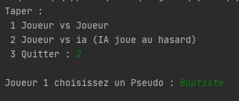
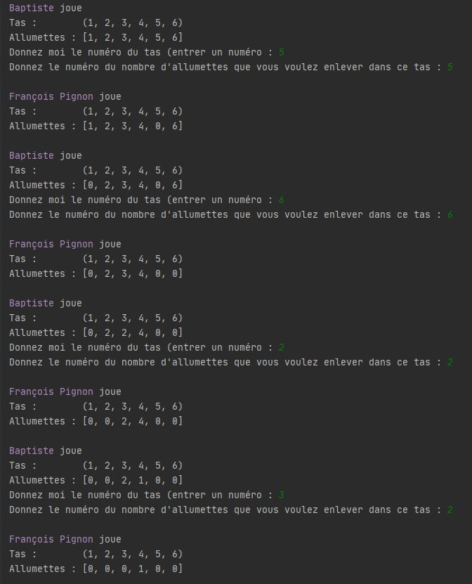
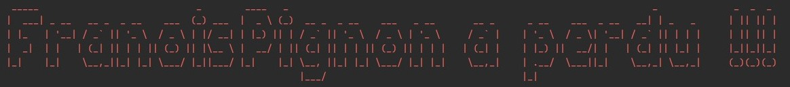

# Marienband
## Rules

Let us first recall the rule of the **game of Marienbad**:

There are 4 rows of tokens or matches or others ... Either here, respectively **1 **, **3 **, **5 **and **7 ** matches Each turn, each player takes the number of matches he wants, but at least one and this in a single row.

- **Variant 1** : the player who takes the last match wins.
- **Variant 2** : the player who takes the last match loses

In my version there are 6 heaps including 1 to 6 lucky holders with the same number of matches

# Images

#### Menu

#### In Game

#### Game Over

